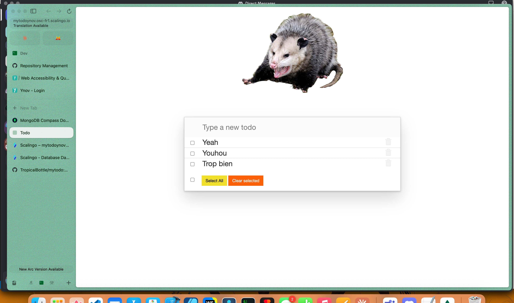
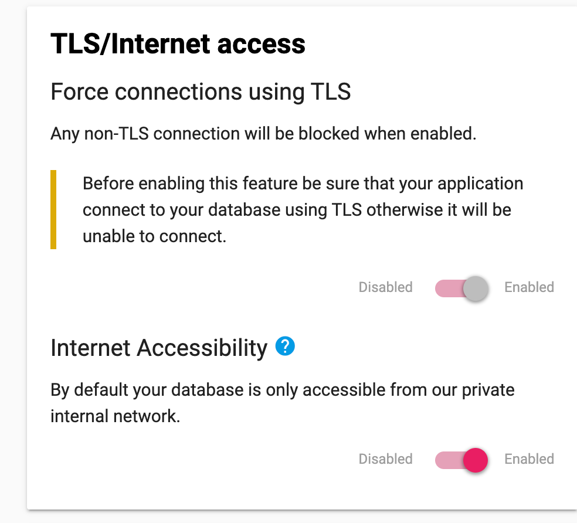
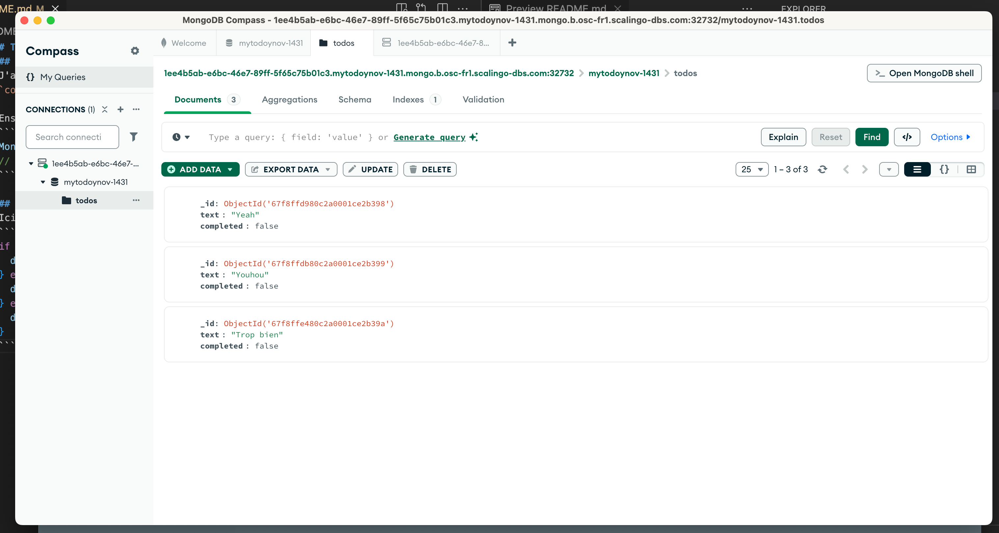

# To-Do application on Scalingo
https://mytodoynov.osc-fr1.scalingo.io/



## Les modifications de db-mongo.js
J'ai ajouté le nom de ma base de donnée à DB NAME dans db-mongo.js
`const DB_NAME = 'mytodoynov-1431';`

Ensuite j'ai décommenté, et commenté les lignes de crédentials pour accéder aux donnée d'environnement crée par Scalingo:
```js
MongoClient.connect(credentials.MONGO_URL, options,  {
// MongoClient.connect(connectionString, options,  {
```

## Les modifications de server.js
Ici j'ai rajouté mon URL mongo:
```js
if (process.env.CLOUDANT_USERNAME !== undefined)  {
  db = require('./lib/db-cloudant')(process.env);
} else if (process.env.MONGO_URL !== undefined) {
  db = require('./lib/db-mongo')(process.env);
} else {
  db = require('./lib/in-memory')();
}
```

## Base de donnée
J'ai activé le TLS depuis le dashboard mongo:


## Mongo Compass
J'ai ensuite mis en place le mongo compass pour voir ma base de donnée:
